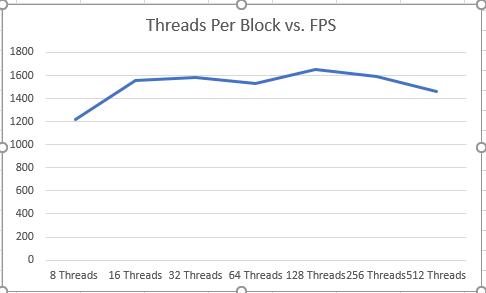

**University of Pennsylvania, CIS 565: GPU Programming and Architecture,
Project 1 - Flocking**

* Emily Vo
  * [LinkedIn](linkedin.com/in/emilyvo), [personal website](emilyhvo.com)
* Tested on: Windows 10, i7-7700HQ @ 2.8GHz 16GB, GTX 1060 6GB (Personal Computer)
Updated the CMakeLists.txt to sm_61.

### README

This simulation has thousands of boids that exhibit flocking behavior. Their velocity is computed based on the positions of their neighbors, and the velocity computations follow three rules. 

The three rules are: 
1) cohesion,  where each boid flocks towards a perceived center of mass.
2) separation, where each boid maintains a minimum distance from others
3) where nearby boids will try to match each others velocities. 

Over time, you can see that the flock behavior becomes more orderly.

This simulation was first implemented with naive neighbor searching, where each boid iterated through every other boid in the simulation to find the nearest neighbors. It was then optimized through a uniform grid data structure, that allowed the boids to look for neighbors in nearby grid cells. Coherence was also implemented to reduce pointer indirection when searching the uniform grid data structure.

### PERFORMANCE ANALYSIS AND CONCEPT QUESTIONS
* For each implementation, how does changing the number of boids affect performance? Why do you think this is?

Generally, increasing the number of boids decreases performance. However, when we use the uniform data structure and coherent data structure, having too few boids decreased performance because of spacial overhead (there is time spent preparing the data structures, and with so few boids, the performance benefit in the search step is not significant).  

* For each implementation, how does changing the block count and block size affect performance? Why do you think this is?

Increasing the block size increased performance until the threads per block exceeded 32. There is no performance increase because my GPU's warp count is 32.

* For the coherent uniform grid: did you experience any performance improvements with the more coherent uniform grid? Was this the outcome you expected? Why or why not?
  * For a smaller number of boids, the coherent uniform grid actually detracted from performance because we had spacial overhead. For a higher number of boids, the coherent uniform grid performed significantly better because there was less pointer indirection. The results were as expected, because conceptually, speed is significantly affected by cache.  Furthermore, the pointer might point to something that isn't cached. The value will then have to be fetched. The program can stall twice if the target pointer's value is also not in cache.

* Did changing cell width and checking 27 vs 8 neighboring cells affect performance? Why or why not? Be careful: it is insufficient (and possibly incorrect) to say that 27-cell is slower simply because there are more cells to check!

    * *Changing the cell width*: To test how changing the cell width affected performanced, I increased a dividing factor by the power of two for each run. As the cell width decreased, the grid resolution increased. This led to a decrease in performance because it would increase the amount of memory used. The grid memory had to be reset and updated each time, so with a larger array used for the grid, there would have to be more time spent pre-processing per frame. 

    
  

    * *Changing the number of cell checks*: When I wanted to change my code to check 27 cells, I simply had to take away consideration of the octant and increase the range of the offset from the grid cell I was currently in. At 10,000 boids, the 27-cell check had a frame rate of 798.8 FPS. The 8-cell check had a frame rate of 975.0 FPS. At 100,000 boids, the 27-cell check had a frame rate of 180.0 FPS. The 8-Cell Check had a frame rate of 279.4 FPS. When deconstructing our algorithm, we know that the grid cell size is two times the rule's radius, so when extending that to 3 dimensions, we only need to check 8 neighboring cells. Checking 27-cells is unnecessary because we iterate over many more boids that are not even in our rule's range.